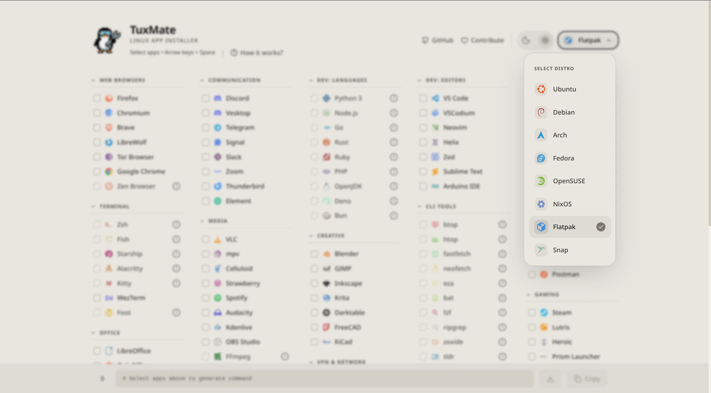
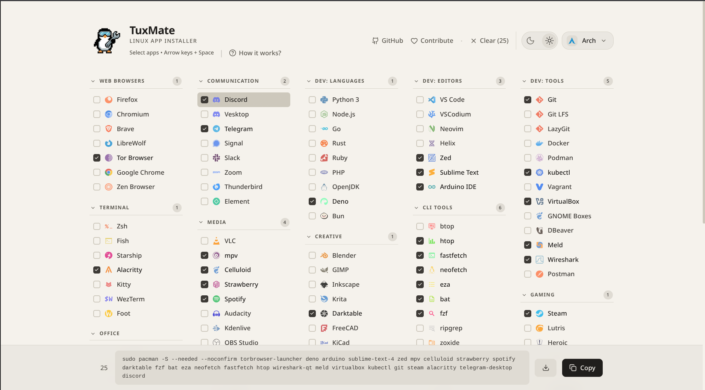

<!-- markdownlint-disable MD041 -->

> **📢 关于本项目**  
> 本项目基于 [TuxMate](https://github.com/abusoww/tuxmate) 进行中文化和优化。  
> 原项目作者：[@abusoww](https://github.com/abusoww) | 许可证：GPL-3.0

<div align="center">
  <h1>Linux 应用安装器</h1>
  <p><em>基于 TuxMate 的完整中文版</em></p>
  


[](LICENSE)

</div>

## 🐧 你安装 Linux 唯一需要的伙伴

**Linux 应用安装器** 是一个基于 Web 的应用安装工具，可以生成针对特定发行版的 Shell 脚本，
旨在成为在全新 Linux 系统上批量安装应用程序的最简单方式。

也许你刚刚安装了一个全新的 Linux 发行版。也许你正在设置一台新机器，或者记不住你最喜欢的应用程序的所有软件包名称？


## 📦 支持的发行版

- Ubuntu / Debian (apt)
- Arch Linux (pacman + AUR)
- Fedora (dnf)
- openSUSE (zypper)
- Nix (nix-env)
- Flatpak
- Snap

## ✨ 特性 🌟

### **应用目录**  
180+ 个应用，涵盖 15 个类别：浏览器、通讯软件、开发工具、终端、媒体、创意软件、游戏、办公、VPN/网络、安全等。

### **智能脚本生成**  
- 检测已安装的软件包
- 在 Arch 上自动处理 AUR 软件包
- 在 Fedora 上按需启用 RPM Fusion
- Flatpak 并行安装
- 网络重试与指数退避
- 带预估时间的进度条
- 彩色输出和总结报告

### **可用性感知**  
显示哪些应用在您选择的发行版上可用，并提供不可用软件包的安装说明。


## 📸 截图






<details>
<summary><h2>💻 开发</h2></summary>

```bash
npm install
npm run dev
```

打开 [http://localhost:3000](http://localhost:3000)

### 构建

```bash
npm run build
npm start
```

</details>


<details>
<summary><h2>🗂️ 项目结构</h2></summary>

```
src/
├── app/                    # Next.js app router
│   ├── page.tsx            # Main page component
│   ├── layout.tsx          # Root layout with meta tags
│   └── globals.css         # Tailwind styles
├── components/
│   ├── app/                # App cards & categories
│   ├── command/            # Command footer & AUR settings
│   ├── common/             # Tooltips, loading states
│   ├── distro/             # Distribution selector
│   ├── header/             # Header links & info
│   ├── search/             # Search overlay
│   └── ui/                 # Theme toggle
├── hooks/                  # React hooks
│   ├── useLinuxInit.ts     # Main app state management
│   ├── useKeyboardNavigation.ts
│   ├── useTheme.tsx
│   └── useDelayedTooltip.ts
├── lib/
│   ├── data.ts             # Apps, distros, icons
│   ├── aur.ts              # AUR package detection
│   ├── analytics.ts        # Umami tracking
│   ├── utils.ts            # Utility functions
│   ├── generateInstallScript.ts
│   └── scripts/            # Per-distro script generators
└── __tests__/              # Vitest unit tests
```

</details>


<details>
<summary><h2>🐳 Docker 部署</h2></summary>

### Docker 快速开始

```bash
# 构建 Docker 镜像
docker build -t linux-app-installer:latest .

# 运行容器
docker run -p 3000:3000 linux-app-installer:latest
```

### 使用预构建镜像

> **注意**：本项目暂未发布 Docker 镜像到容器注册表。  
> 请使用上述构建命令在本地构建镜像，或等待后续发布。

如果你想发布自己的镜像到 GitHub Container Registry：

```bash
# 构建并推送（需要先登录 GitHub Container Registry）
docker build -t ghcr.io/你的用户名/linux-app-installer:latest .
docker push ghcr.io/你的用户名/linux-app-installer:latest
```

### 使用 Docker Compose（推荐）

```bash
# 启动应用
docker-compose up -d

# 查看日志
docker-compose logs -f

# 停止应用
docker-compose down
```

打开 [http://localhost:3000](http://localhost:3000)

### 配置

Docker 容器默认暴露 3000 端口。你可以自定义端口映射：

```bash
docker run -p 8080:3000 linux-app-installer:latest
```

### 环境变量

默认配置了以下环境变量：

- `NODE_ENV=production` - 在生产模式下运行
- `PORT=3000` - 应用端口
- `NEXT_TELEMETRY_DISABLED=1` - 禁用 Next.js 匿名遥测

运行容器时可以覆盖这些变量：

```bash
docker run -p 3000:3000 \
  -e PORT=3000 \
  -e NEXT_TELEMETRY_DISABLED=1 \
  linux-app-installer:latest
```

</details>


## 🛠️ 技术栈

- [Next.js](https://nextjs.org/) 16 (App Router)
- [React](https://react.dev/) 19
- [TypeScript](https://www.typescriptlang.org/)
- [Tailwind CSS](https://tailwindcss.com/) 4
- [Framer Motion](https://www.framer.com/motion/)
- [GSAP](https://gsap.com/)
- [Vitest](https://vitest.dev/) (testing)
- [Lucide React](https://lucide.dev/) (icons)


## 🚀 使用方法
1. 从下拉菜单中选择你的发行版
2. 浏览分类并选择应用程序
3. 复制生成的命令或下载完整的安装脚本
4. 在你的 Linux 机器上运行脚本

### ⌨️ 键盘快捷键

| 按键 | 操作 |
|-----|--------|
| `↑` `↓` `←` `→` / `h` `j` `k` `l` | 导航应用 |
| `空格` | 切换应用选择 |
| `Esc` | 清除焦点 |
| `/` | 聚焦搜索 |
| `y` | 复制命令 |
| `d` | 下载脚本 |
| `t` | 切换主题 |
| `c` | 清除所有选择 |
| `Tab` | 切换预览抽屉 |

## 🤝 贡献

查看 [CONTRIBUTING.md](CONTRIBUTING.md) 了解贡献指南。


## 🎯 路线图

### 已完成
- [x] Multi-distro support (Ubuntu, Debian, Arch, Fedora, openSUSE)
- [x] Nix, Flatpak & Snap universal package support
- [x] 180+ applications across 15 categories
- [x] Smart script generation with error handling
- [x] Dark / Light theme toggle with smooth animations
- [x] Copy command & Download script
- [x] Custom domain
- [x] Docker support
- [x] CI/CD shortcuts & workflow
- [x] Search & filter applications (Real-time)
- [x] AUR Helper selection (yay/paru) + Auto-detection
- [x] Keyboard navigation (Vim keys, Arrows, Space, Esc, Enter)
- [x] Package availability indicators (including AUR badges)


### 计划中

- [ ] Winget 支持（Windows）
- [ ] Homebrew 支持（macOS）
- [ ] 保存自定义预设/配置文件
- [ ] 通过 URL 分享配置
- [ ] 更多发行版（Gentoo、Void、Alpine）
- [ ] PWA 支持离线使用
- [ ] CLI 配套工具
- [ ] 扩展应用目录（200+）
- [ ] Dotfiles 集成

<details>
<summary><h4>🔗 相关项目</h4></summary>
	
- **[LinuxToys](https://github.com/psygreg/linuxtoys)** – User-friendly collection of tools for Linux with an intuitive interface
- **[Nixite](https://github.com/aspizu/nixite)** – Generates bash scripts to install Linux software, inspired by Ninite
- **[tuxmate-cli](https://github.com/Gururagavendra/tuxmate-cli)** – CLI companion for tuxmate, uses tuxmate's package database

</details>

<div align="right">

## 📜 许可证
采用 [GPL-3.0 许可证](LICENSE) <br>
自由软件 — 你可以在 GNU 通用公共许可证的条款下重新分发和修改它。

<p align="center">
	
</p>
